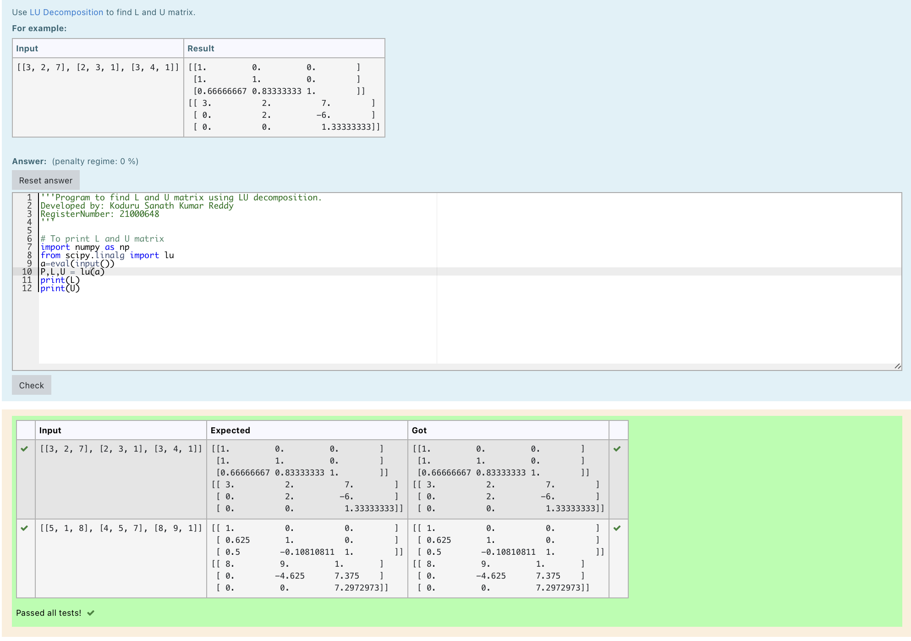
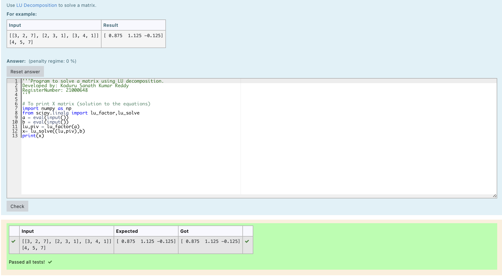

# LU Decomposition without zero on the diagonal

## AIM:
To write a program to find the LU Decomposition of a matrix.

## Equipments Required:
1. Hardware – PCs
2. Anaconda – Python 3.7 Installation / Moodle-Code Runner

## Algorithm
1. 
2. 
3. 
4. 

## Program:
```
/*
Program to find the LU Decomposition of a matrix.
Developed by: Koduru Sanath Kumar Reddy
RegisterNumber: 21000648
*/
```
### To print L and U matrix
~~~
import numpy as np
from scipy.linalg import lu
a=eval(input())
P,L,U = lu(a)
print(L)
print(U)
~~~
```
/*
Program to solve the given matrix using LU Decompostion.
Developed by: Koduru Sanath Kumar Reddy
RegisterNumber: 21000648
*/
```
### To print X matrix (solution to the equations)
~~~
import numpy as np
from scipy.linalg import lu_factor,lu_solve
a = eval(input())
b = eval(input())
lu,piv = lu_factor(a)
x= lu_solve((lu,piv),b)
print(x)
~~~

## Output:
### Problem 1

### Problem 2



## Result:
Thus the program to find the LU Decomposition of a matrix is written and verified using python programming.

